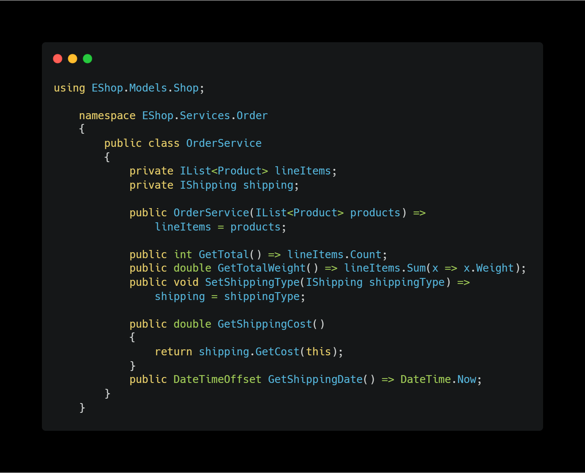

# EShop
This development is about to get shopping.

The app has several use-cases such as auhtentication service,
shipping service, and user-readble console ui.

## Auhtentication

## 1. We have FileStorageBroker which works on credentials.
you can use it for add credential to the file  and get all credentials 
from the file, and it inherit from IStorageBroker.cs interface.

        

        
### LoginService.cs

## 2. We have also MemoryBroker inherits from IStorageBroker.cs interface. The broker work with products and use in-memory for storing products.

### MemoryBroker.cs

## Logging

Main is logging broker. The broker manage to log on console. It has four essential methods.

LoggingBroker.cs

## Model

 
## We have some sort of shipping types and you can use all of that you want.

### 1.Sea
### 2.Air
### 3.Ground  and many more

#### -Air

#### -Ground

#### -Sea

### And at the end we show you main Oreder service.

### Main part is switching the shippings using IShipping interface because every shipping type classes inherit from it. We can implement **'O'** in the __Solid__.

Setting Shipping type : 

---

## Result.

